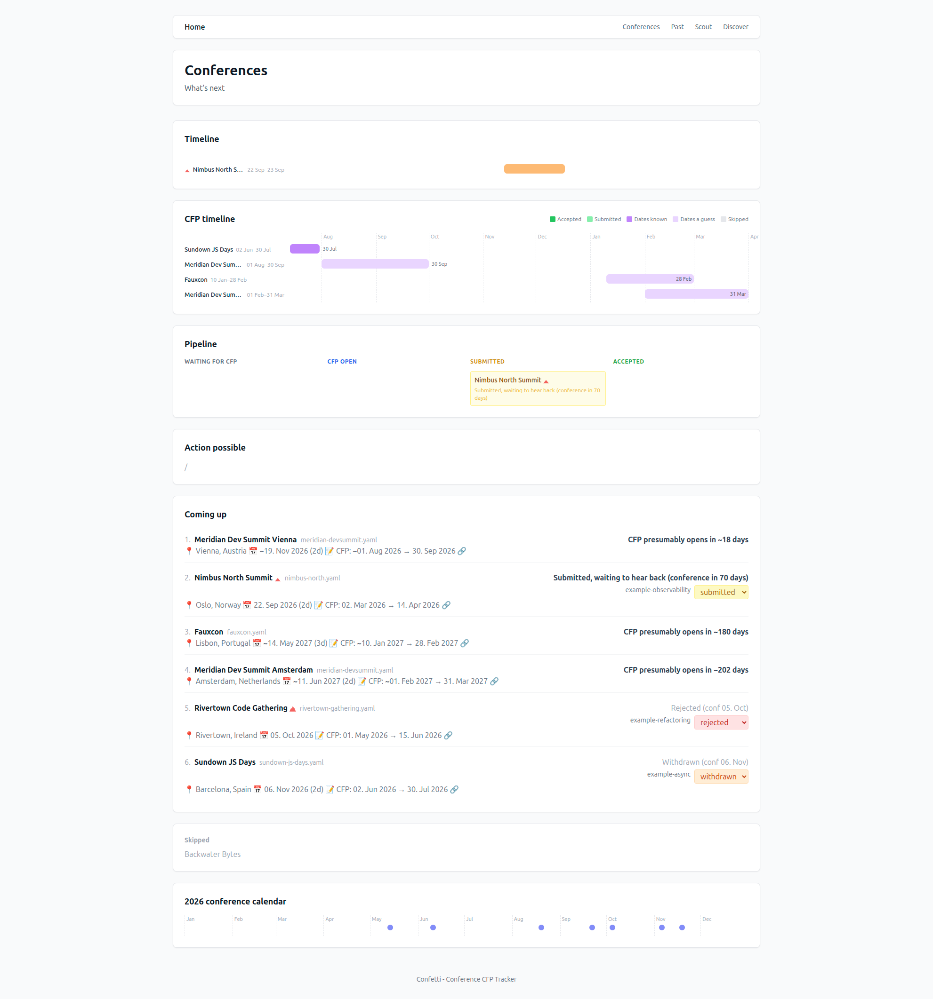
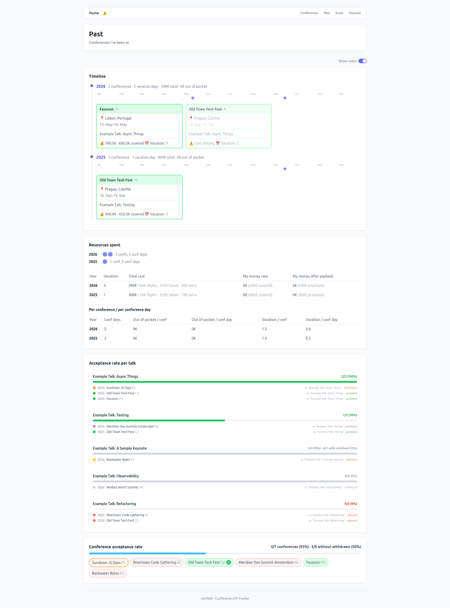
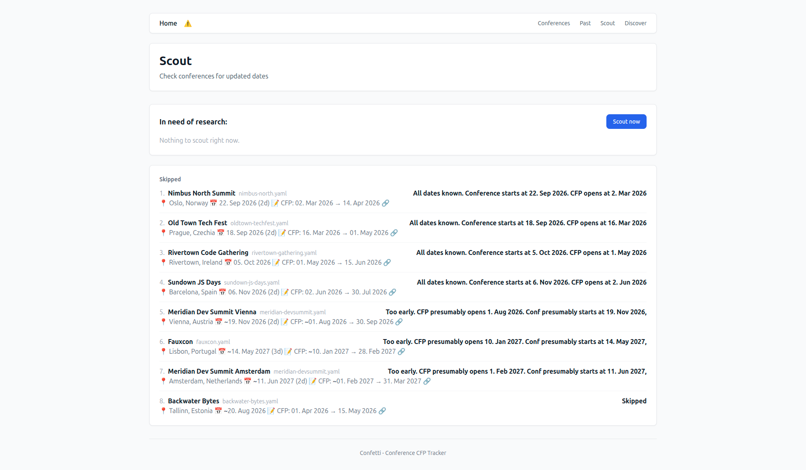
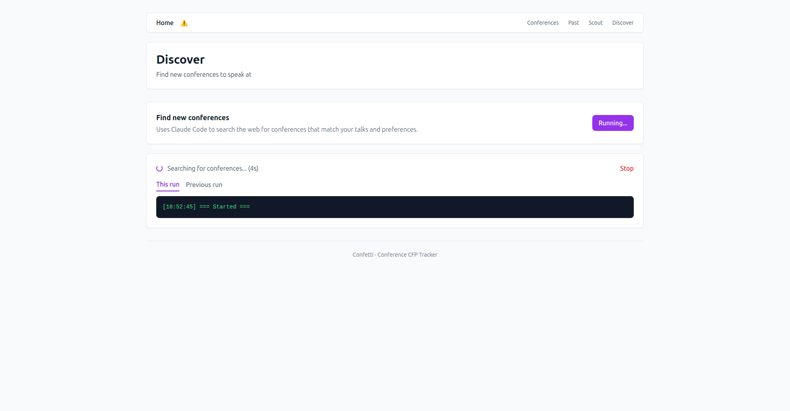
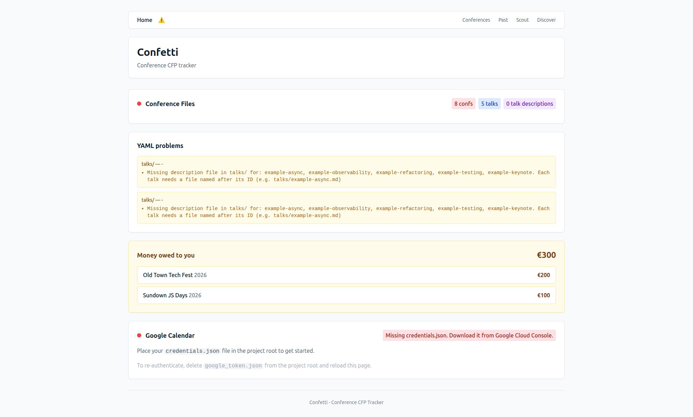
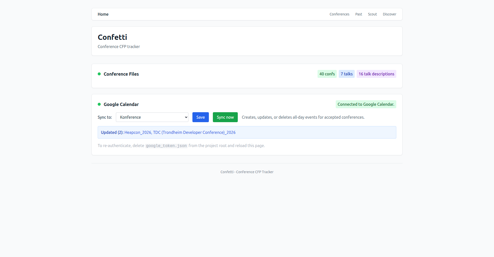

# Confetti Engine

Conference CFP tracker. Keeps track of my potential conferences, their CFP deadlines, and syncs everything to Google Calendar.

Each conference lives in its own YAML file in `conferences/`.


## Quick Start

1. **Start** the server:
   ```bash
   make up
   ```

2. **Open [http://localhost:1250](http://localhost:1250)** to check that everything is set up correctly.


## What it looks like

The conferences page: a CFP timeline, a submission pipeline, and what's coming up next.



The past page: what each trip cost, how many vacation days it burned, and the acceptance rate per talk.



Scouting: checks every conference for updated dates and tells you why it skipped the rest.



Discovery: a Claude agent searches the web for new conferences that fit your talks.



Bad YAML does not crash the app. Every problem lands on the home page with the file and the reason. The home page also tracks the money conferences still owe you.




## How it works

1. **Track conferences**: I add a YAML file per conference in `conferences/` with CFP dates, conference dates, travel info. But you can add any number of conferences into 1 YAML file (group them as you see fit).
2. **Presumed vs actual dates**: Each conference has "presumed" dates (based on prior years) and "actual" dates (filled in when announced)
3. **Sync to Google Calendar**: A sync script pushes CFP deadlines and conference dates to my Google Calendar — actual dates when available, presumed as fallback


## Google Calendar Setup

Google unfortunately doesn't offer a simple token-based API access, not even a personal API token. They only support OAuth. On top of that they have a whole Google-Cloud-Project infrastructure with 20+ steps, so that is what we have to do to sync conference events.

_I'm paraphrasing this guide: [Python quickstart](https://developers.google.com/workspace/calendar/api/quickstart/python)._

### Requires OAuth 2.0 setup:

1. Create a project in the [Google Cloud Console](https://console.cloud.google.com/projectcreate)
2. [Enable the Google Calendar API](https://console.cloud.google.com/flows/enableapi?apiid=calendar-json.googleapis.com) for your project
3. Configure [OAuth in Branding](https://console.cloud.google.com/auth/branding) (set to "External", add yourself as a test user)
4. Authorize credentials for a desktop application in [Google Auth platform > Clients](https://console.cloud.google.com/auth/clients). Create new client and choose "Desktop app" type. The newly created credential appears under "OAuth 2.0 Client IDs."
5. Download the credentials JSON and save it as `credentials.json` in the project root. The code expects the name and path to be exactly that.

I've set this up to be forever in test mode. But if you have a working OAuth access, use that! No need to create a whole new OAuth flow just for this little script.

### How it works

1. Place `credentials.json` in the project root
2. Home page shows "Connect Google Calendar" button
3. Clicking it redirects to Google's OAuth consent screen
4. After consent, callback saves token to `google_token.json`
5. Home page shows green "Connected" status with a calendar picker
6. Pick which calendar to sync to, hit "Sync now"

Once connected, the home page shows the sync status and what changed on the last run:




## Development

Dependencies are managed with [uv](https://docs.astral.sh/uv/getting-started/installation/).

```bash
# Install dependencies
uv sync

# Run the server
make up

# Lint & format & test
make lint test
```

---

&copy; Ines Panker. All rights reserved. Shared for evaluation.
